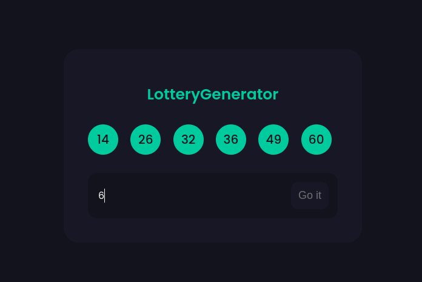

# 💸 LotteryGenerator



<br>

A simple app made in reactjs to generate random lottery numbers, from 1 to 60.

<br>

## 🚀 Getting Started

This project was bootstrapped with [Create React App](https://github.com/facebook/create-react-app).

```
  npm start
```

Runs the app in the development mode.\
Open [http://localhost:3000](http://localhost:3000) to view it in your browser.
